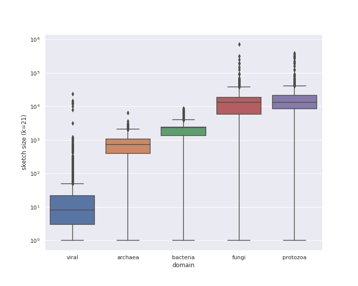

<!--
The {#rmd-basics} text after the chapter declaration will allow us to link throughout the document back to the beginning of Chapter 1.  These labels will automatically be generated (if not specified) by changing the spaces to hyphens and capital letters to lowercase.  Look for the reference to this label at the beginning of Chapter 2.
-->

# Accurate containment estimation with Scaled MinHash sketches

\chaptermark{Scaled}

## Introduction

<!-- TODO
- Note, can be narrow given the whole thesis introduction.
- paragraph 1: what is the technical problem of interest? lightweight compositional queries? motivate briefly with some biology, maybe.
- paragraph 2: motivate narrowing our focus to k-mer containment and minhash-based techniques. Will you consider dashing etc?
-->

A data sketch is a representative proxy for the original data focused on queries for specific properties.
It is also a probabilistic data structure since it uses hashing techniques to provide statistical guarantees on the precision of the answer for a query.
This allows a memory/accuracy trade-off:
using more memory leads to more accurate results,
but in memory-constrained situations it still bound results to an expected error rate.

### MinHash sketch: similarity and containment

The MinHash sketch [@broder_resemblance_1997] was developed at Altavista in the context of document clustering and deduplication.
It provides an estimate of the Jaccard similarity
(called **resemblance** in the original article)
and the **containment** of two documents,
estimating how much of document $A$ is contained in document $B$.
<!-- TODO:
J(A, B) = frac{\vert A \cup B \vert }{\vert A \cap B \vert}
C(A, B) = frac{\vert A \cup B \vert }{\vert A \vert}
-->
These estimates depend on two processes:
converting documents to sets ("Shingling"),
and transforming large sets into short signatures,
while preserving similarity ("Min-Hashing").
In the original use case the *$w$-shingling* $\Omega$ of a document $D$ is defined as the set of all continuous subsequence of $w$ words contained in $D$.
*Min-hashing* is the process of creating $W = \{\,h(x) \mid \forall x \in \Omega\,\}$,
where $h(x)$ is an uniform hash function,
and then either

a) keeping the $n$ smallest elements ($\mathbf{MIN}_n(W)$, a MinHash), or
b) keeping elements that are $0 \mod m$ ($\mathbf{MOD}_m(W)$, a ModHash).

$\mathbf{MIN}_n(W)$ is fixed-sized (length $n$) and supports similarity estimation,
but doesn't support containment.
$\mathbf{MOD}_m(W)$ supports both similarity and containment,
with the drawback of not being fixed-sized anymore,
growing with the complexity of the document.

### Mash and genomic minhash

Mash [@ondov_mash:_2016] was the first implementation of MinHash in genomic contexts,
relating the $w$-shingling of a document to the $k$-mer composition of genomic datasets,
and using the $\mathbf{MIN}_n(W)$ fixed-sized formulation for the signature.
Mash needs extra information (the genome size for the organism being queried) to account for genomic complexity in datasets and derives a new score,
the Mash distance,
to bring it closer to previously existing similarity measures in biology
(Average Nucleotide Identity).
This extra information is required because using a fixed-size MinHash leads to
different degrees of accuracy when comparing across highly-diverged organisms
(bacteria to animals, for example),
and it is even more extreme when taking more complex datasets into account (like metagenomes).

### Containment MinHash

CMash [@koslicki_improving_2019] implements the Containment MinHash with the goal of allowing containment estimates between sets of very different sizes.
The construction is the same as MinHash for the smaller dataset,
but the larger dataset $k$-mer composition is stored in a Bloom Filter [@bloom_spacetime_1970],
which can also be calculated while streaming the data.
The containment is defined as the number of hashes from the MinHash $A$ present in the Bloom Filter $B$,
divided by the size of $A$:
$$C(A, B) = \frac{\vert \{\,h \in B \mid \forall h \in \mathbf{MIN}_n(W)\,\} \vert}{\vert \mathbf{MIN}_n(W) \vert}$$

Since the Containment MinHash approach is not doing MinHash-to-MinHash comparisons,
it also avoids needing to store a large set of hashes in order to keep the
containment estimation within small error bounds (less than 1\%).

This formulation enables the comparison of metagenomes (stored in a Bloom Filter)
against a collection of MinHash sketches (one for each reference dataset),
a use case not supported by Mash originally.

In terms of repeated analysis of a query,
\emph{CMash} has the advantage that the query only needs to be processed once into a Bloom Filter,
and can later be reused when the collection of reference MinHash sketches is updated.
This precludes the need to keep the original query,
and since the Bloom Filter is much smaller than the original dataset in most cases
that leads to storage savings for this use case.

### Containment score and mash screen

[@ondov_mash_2019] introduces a new method to Mash (\emph{mash screen}) for calculating containment scores.
Given a collection of reference MinHash sketches and a query sequence mixture (a metagenome, for example),
\emph{mash screen} builds a mapping of each distinct hash from the set of all hashes in the reference MinHash sketches to a count of how many times the hash was observed.
The query sequence mixture is decomposed and hashed with the same parameters $k$
(from the $k$-mer composition) and $h$ (the hash function) used to generate the reference MinHash sketches,
and for each hash in the query also present in the mapping the counter is updated.
Finally,
after the mapping is completed each reference MinHash sketch is summarized by
checking the counts for each of its hashes in the mapping and then producing a
final containment estimate.

<!--
`mash screen` also defines a new metric,
the Mash Containment,
to model the $k$-mer survival
-->

Comparing \emph{mash screen} to \emph{CMash},
the main difference is that the former streams the query as raw sequencing data,
while the latter generates a Bloom Filter for the query first.
\emph{mash screen} avoids repeated membership checks to a Bloom Filter by collecting all distinct hashes across the reference MinHash sketches first,
and then updating a counter associated with each hash if it is observed in the query.
After the query finishes streaming,
then it is summarized again against the sketches in the collection.

\emph{mash screen} also needs the original data for the query during reanalysis,
because adding new sketches to the collection of references might introduce new hashes not observed before.
For large scale projects like reanalysis of all the SRA metagenomes this
requirement means continuous storage or re-download of many petabytes of data.

## Scaled MinHash

The Scaled MinHash is a mix of MinHash and ModHash.
From the former it keeps the smallest elements,
and from the latter it adopts the dynamic size to allow containment estimation.
Instead of taking $0 \mod m$ elements like $\mathbf{MOD}_m(W)$,
a Scaled MinHash uses a parameter $s$ to select a subset of $W$:
$$\mathbf{SCALED}_s(W) = \{\,w \leq \frac{H}{s} \mid \forall w \in W\,\}$$,
where $H$ is the largest possible value in the domain of $h(x)$ and
$\frac{H}{s}$ is the \emph{maximum hash} value in the Scaled MinHash.

Given an uniform hash function and $s=m$,
the cardinalities of $\mathbf{SCALED}_s(W)$ and $\mathbf{MOD}_m(W)$ converge for large $\vert W \vert$.
The main difference is the range of possible values in the hash space,
since the Scaled MinHash range is contiguous and the ModHash range is not.
Figure \ref{fig:minhashes} shows an example comparing MinHash, ModHash and Scaled MinHash with the same parameter value.

\begin{figure}%[ht]
    \begin{subfigure}{\textwidth}
      \centering
        \begin{tikzpicture}
        \draw[] (0,0) -- (7.75,0) ; %edit here for the axis
        \foreach \x in  {0,...,31} % edit here for the vertical lines
          \draw[shift={(\x/4,0)},color=black] (0pt,2pt) -- (0pt,-2pt);
        \foreach \x in {0,8,16,24,31} % edit here for the numbers
          \draw[shift={(\x/4,0)},color=black] (0pt,0pt) -- (0pt,-3pt) node[below] {$\x$};
        \foreach \x in {0,...,31} % edit here for the markers
          \node[mark size=3pt] at (\x/4,0) {\pgfuseplotmark{triangle}};
        \foreach \x in {0,3,6,9,12,15,18,21,24,27,30} % edit here for the markers
          \draw[shift={(\x/4,6pt)},color=red] (0,2pt) -- (0,-2pt);
        \foreach \x in {0,3,6,9} % edit here for the markers
          \node[mark size=3pt,color=red] at (\x/4,0) {\pgfuseplotmark{triangle*}};
        \end{tikzpicture}
      \caption{$\mathbf{MIN}_4(W)$}
      \label{fig:sub-first}
    \end{subfigure}\vspace{0.02\textheight}
    \begin{subfigure}{\textwidth}
      \centering
        \begin{tikzpicture}
        \draw[] (0,0) -- (7.75,0) ; %edit here for the axis
        \foreach \x in  {0,...,31} % edit here for the vertical lines
          \draw[shift={(\x/4,0)},color=black] (0pt,2pt) -- (0pt,-2pt);
        \foreach \x in {0,8,16,24,31} % edit here for the numbers
          \draw[shift={(\x/4,0)},color=black] (0pt,0pt) -- (0pt,-3pt) node[below] {$\x$};
        \foreach \x in {0,4,8,12,16,20,24,28} % edit here for the markers
          \node[mark size=3pt] at (\x/4,0) {\pgfuseplotmark{oplus}};
        \foreach \x in {0,3,6,9,12,15,18,21,24,27,30} % edit here for the markers
          \draw[shift={(\x/4,6pt)},color=red] (0,2pt) -- (0,-2pt);
        \foreach \x in {0,12,24} % edit here for the markers
          \node[mark size=3pt,color=red] at (\x/4,0) {\pgfuseplotmark{oplus*}};
        \end{tikzpicture}
      \caption{$\mathbf{MOD}_4(W)$}
      \label{fig:sub-second}
    \end{subfigure}\vspace{0.02\textheight}
    \begin{subfigure}{\textwidth}
      \centering
        \begin{tikzpicture}
        \draw[] (0,0) -- (7.75,0) ; %edit here for the axis
        \foreach \x in  {0,...,31} % edit here for the vertical lines
          \draw[shift={(\x/4,0)},color=black] (0pt,2pt) -- (0pt,-2pt);
        \foreach \x in {0,8,16,24,31} % edit here for the numbers
          \draw[shift={(\x/4,0)},color=black] (0pt,0pt) -- (0pt,-3pt) node[below] {$\x$};
        \foreach \x in {0,1,2,3,4,5,6,7} % edit here for the markers
          \node[mark size=3pt] at (\x/4,0) {\pgfuseplotmark{diamond}};
        \foreach \x in {0,3,6,9,12,15,18,21,24,27,30} % edit here for the markers
          \draw[shift={(\x/4,6pt)},color=red] (0,2pt) -- (0,-2pt);
        \foreach \x in {0,3,6} % edit here for the markers
          \node[mark size=3pt,color=red] at (\x/4,0) {\pgfuseplotmark{oplus*}};
        \end{tikzpicture}
      \caption{$\mathbf{SCALED}_4(W)$}
      \label{fig:sub-third}
    \end{subfigure}\vspace{0.02\textheight}
\caption{Comparing the behavior of different MinHash approaches with the same parameter
         value $n=m=s=4$ and a hash function with domain $[0,31]$ (5 bits). Possible
         values for each MinHash are represented with hollow shapes. Elements from
         $W=\{\,0 \mod 3 \mid \forall w \in W\,\}$ are marked with red lines
         above the axis.}
\label{fig:minhashes}
\end{figure}

### Operations without the original data
<!-- TODO: yuck, better subsection title -->

Once a Scaled MinHash is calculated there are many operation that can be applied without depending on the original data,
saving storage space and allowing scaling analysis to thousands of datasets.
Most of these operations are also possible with MinHash and ModHash,
with caveats.
One example of these operations is \emph{downsampling}:
the contiguous value range for Scaled MinHash sketches allow deriving $\mathbf{SCALED}_{s'}(W)$ sketches for any $s' \ge s$ using only $\mathbf{SCALED}_{s}(W)$,
MinHash and ModHash also support this operation,
as long as $n' \le n$ and $m'$ is a multiple of $m$.

Because Scaled MinHash sketches collect any value below a threshold this also guarantees that once a value is selected it is never discarded.
This is useful in streaming contexts:
any operations that used a previously selected value can be cached and updated with new arriving values.
$\mathbf{MOD}_m(W)$ has similar properties,
but this is not the case for $\mathbf{MIN}_n(W)$,
since after $n$ values are selected any displacement caused by new data can invalidate previous calculations.

Abundance tracking is another extension to MinHash sketches,
keeping a count of how many times a value appeared in the original data.
This allows filtering for low-abundance values,
as implemented in Finch [@bovee_finch:_2018],
another MinHash sketching software for genomics.
Filtering values that only appeared once was implemented before in Mash by using a Bloom Filter and only adding values after they were seen once,
with later versions also implementing an extra counter array to keep track of counts for each value in the MinHash.
<!-- TODO: discuss here how abundance tracking in MinHash is not "correct",
because it is not a proper weighted subsample of the data?
Note that Scaled MinHash is a proper weighted subsample
-->

Other operations are adding and subtracting hash values from a Scaled MinHash sketch,
allowing post-processing and filtering.
Although possible for $\mathbf{MIN}_n(W)$,
in practice this requires oversampling (using a larger $n$) to account for possibly having less than $n$ values after filtering.
This is the approach taken by Finch [@bovee_finch:_2018],
for example.

<!--
What is the difference with modulo hash (per Broder 1997)? Modulo is expensive vs less-than operator; convertible between minhash and modhash.
address brad’s comment on f1000 paper: the existing modulo approach has no guarantees on equal-sized
(or even equal-fraction as the manuscript claims elsewhere) sub-sampling

Features of scaled:
* subsampling to lower densities
* streaming guarantees (never lose hash value - containment never decreases as you get more data)
* add and subtract hash values (category, “operations directly on sketches”?)
* abundance filter hash values (operations directly on sketches)
* poisson statistics / random sequence foo
  + “A value of 2000 means that we are 99.98% likely to choose one k-mer per 10kb window,
    or to rephrase it, 9998 of 10000 windows of size 10kb will have at least one chosen k-mer in them.”
 see [numbers from charcoal](https://github.com/dib-lab/charcoal/blob/master/stats/stats.ipynb).

Could also alternatively phrase scaled as lossy compression, more so than minhash.

-->

### Limitations

A drawback of Scaled MinHash when compared to regular MinHash sketches is the size:
the MinHash parameter $s$ sets an upper bound on the size of the sketch,
independently of the size of the original data.
Scaled MinHash sketches grow proportionally to the original data cardinality,
and in the worst case can have up to $\frac{H}{s}$ items.

Another limitation is loss of sensitivity to small datasets when using larger $s$ values.
A biological example are viruses:
at $s=1000$ many viruses are too small to consistently have a hashed value
picked by the Scaled MinHash approach.

<!-- TODO
- increased size (compared with minhash, which is constant size)
- detection threshold (viruses)
- CTB: include poisson statistics and plot of how many windows are missed (from charcoal stats)
-->

## Implementation

### smol

`smol` is a minimal implementation for the Scaled MinHash sketch and the gather method for simulation and verifying results with more featureful tools.
There are two compatible versions,
one in Python and another in Rust,
due to performance requirements when processing large datasets (like metagenomes).
Both versions of the Scaled MinHash implementations use each language standard library sets
(`set` for Python, `HashSet` for Rust)
for storing hashes and efficient set operations (intersection and difference).
Experiments used the Rust version for calculating Scaled MinHash sketches,
and the Python version for running gather and reporting containment scores.
Since they serialize the sketches to a compatible JSON format,
they can be used interchangeably and while computing Scaled MinHash sketches is
orders of magnitude faster in Rust,
for gather running time are similar and in the order of seconds.

The Python version has two external dependencies:
`screed` for sequence parsing,
and `mmh3` for the MurmurHash3 hash function.
Other modules from the standard library are used for JSON serialization (`json`)
and command line parsing (`argparse`).

The Rust version has four direct external dependencies:
`needletail` for sequence parsing and normalization
(similar to what `screed` does in the Python version),
`murmurhash3` for the MurmurHash3 hash function,
`serde_json` for JSON serialization and `structopt` for command line parsing.

### exact

`exact` is an exact k-mer counting implementation in Rust.
It also uses the standard library `HashSet` to store the $k$-mer composition of
a dataset,
and Needletail for sequence parsing.
It differs from `smol` because it stores all canonical $k$-mers,
instead of a subset.
The `bincode` library is used for serialization,
since it provides a simpler binary format output for Rust data types.
The goal is not to have a general purpose tool,
but only a way to calculate the ground truth for containment in a dataset,
and so a more compatible serialization format
(like JSON in the `smol` case)
is not required.

## Evaluation

### Average Scaled MinHash sketch sizes across Genbank domains

```{r scaledGenBankSizes, eval=TRUE, echo=FALSE, message=FALSE, error=FALSE, warning=FALSE, cache=TRUE, fig.width=4, fig.cap="Scaled MinHash sketch sizes over GenBank domains, s=2000.", out.width="400px"}

```

### Comparison with other containment estimation methods

In this section the Scaled MinHash method is compared to CMash (containment
MinHash) and mash screen (containment score).

<!-- TODO
- show method works, even if slow, lead to introduction of other indices

- use exact and scaled=1000, show results are similar.

- use podar dataset

- compare with cmash/mash screen here?
-->

### Implementation for experiments

Experiments are implemented in `snakemake` workflows and use `conda` for
managing dependencies,
allowing reproducibility of the results with one command:
`snakemake --use-conda`.
This will download all data,
install dependencies and generate the data used for analysis.

The analysis is contained in a Jupyter Notebook,
and can be executed in any place where it is supported,
including in a local installation or using Binder,
a service that deploy a live Jupyter environment in cloud instances.
Instructions are available at https://github.com/luizirber/phd
<!-- TODO: replace with zenodo archival DOI -->

<!-- TODO: related work section? It's sort of covered with cmash and mash screen
already -->

## Conclusion and Future Work

<!-- TODO
- CTB 2-3 paragraphs
- our hashing approach is simple to implement, simple to analyze.
- has some upsides - no need to reindex. summarize comparison with other techniques briefly.
- Has some drawbacks, summarize briefly.
- Building software ecosystem to allow practical application in many ways - gather, indices, etc. Discussed in following chapters.
-->
