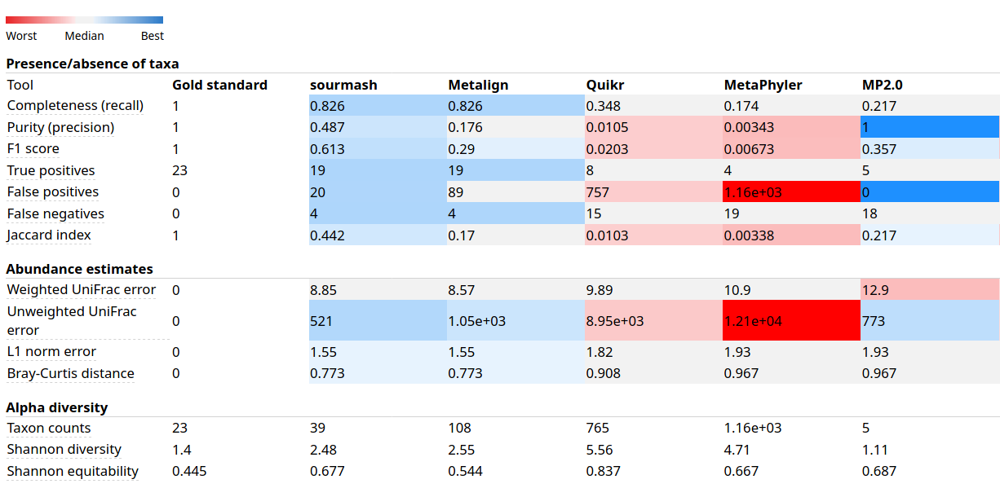
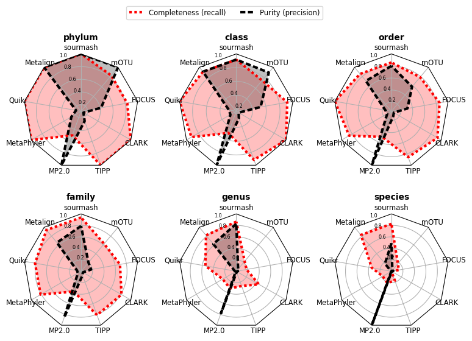
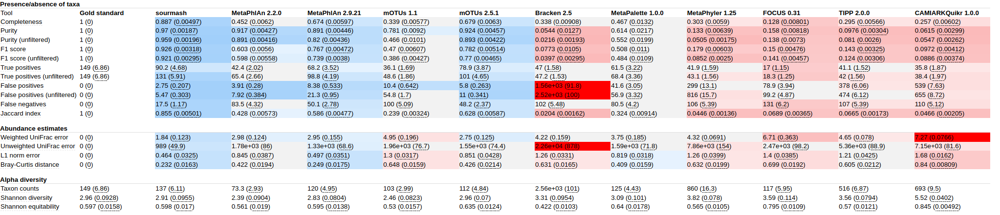

# Compositional analysis with Scaled MinHash and gather

\chaptermark{Gather}

## Introduction

<!--
 - What are the goals of compositional analysis in biological systems?
-->

Taxonomic profiling is a particular instance of this general problem.
The goal of taxonomic profiling is to find the identity and relative abundance of microbial community elements
at a specific taxonomic level (species, genus, family...),
especially in metagenomic samples [@sczyrba_critical_2017].

Existing taxonomic profilers use different methods to solve this problem,
including:

  - aligning sequences to a reference database [@huson_megan_2016];

  - using marker genes derived from known organisms from reference databases [@segata_metagenomic_2012]
or coupled with unknown organisms clustered from metagenomes [@milanese_microbial_2019];

  - exact $k$-mer matching using fixed $k$ and lowest common ancestor (LCA) for resolving $k$-mer assignments matching multiple taxons from a reference database
    [@wood_kraken:_2014] or variable $k$ and assigning multiple taxons per sequence,
    with an option to reduce it further to the LCA [@kim_centrifuge_2016].

Once each sequence (from raw reads or assembled contigs) has a taxonomic assignment,
these methods resolve the final identity and abundance for each member of the community by summarizing the assignments to a specific taxonomic level.

### Decomposition of queries with gather

Methods that summarize taxonomic assignments from sequences in the query metagenome to calculate the profile for the community follow a bottom-up approach.
Instead of using taxonomic assignments at the sequence level,
a top-down approach <!-- TODO ... -->


`gather` is an example of such a top-down approach:
starting from the $k$-mer composition of the query,
it iteratively finds a match in a collection of datasets with the largest _containment_ of the query (most elements in common),
and create a new query by _removing elements_ in the match from the original query.
The process stop when the new query doesn't have any more matches in the collection,
or a user-provided minimum detection threshold is reached.
This approach also differs from previous methods because the co-occurrence of $k$-mers
in a match is considered a strong signal that they are coming from the same organism in the original sample,
and is used instead of the LCA-based methods to resolve ambiguities in the taxonomic assignment of the $k$-mer.

Any data structure supporting both the _containment_
$C(A, B) = \frac{\vert A \cap B \vert }{\vert A \vert}$
and _removing elements_ operations can be used as a query with `gather`.
For example,
a _set_ of the $k$-mer composition of the query supports element removal,
and calculating containment can be done with regular set operations.
Approximate membership query (AMQ) sketches like the _Counting Quotient Filter_ [@pandey_general-purpose_2017] can also be used,
with the benefit of reduced storage and memory usage.
Moreover,
the collection of datasets can be implemented with any data structure that can do containment comparisons with the query data structure,
including implicit representations like an inverted index from hashed $k$-mers to dataset IDs (as detailed in subsection [2.1.2](#inverted-index)).

<!-- TODO crossref with section/subsection is not using all the numbers (only the chapter)... -->

### Implementing gather with Scaled MinHash sketches

_Scaled MinHash_ sketches (section [1.2](#scaled-minhash)) are a subset of the $k$-mer composition $M$ of a dataset,
with the guarantee that if a hash $w'=h(m)$ of $k$-mer $m \in M$ is present in the _Scaled MinHash_ sketch with scaled parameter $s$
$$\mathbf{SCALED}_s(W) = \{\,w \leq \frac{H}{s} \mid \forall w \in W\,\}$$
where $W = \{\,h(m) \mid \forall m \in M\,\}$,
$h(x)$ is an uniform hash function and $H$ is the maximum value possible for $h(.)$,
the same hash $w'$ will be present in sketches for other datasets also containing the $k$-mer $m$,
as long as they have the same parameter $s$ or can be downsampled to the same $s$.
This is not guaranteed for regular _MinHash_ sketches, <!-- TODO because fixed size explanation -->
and is what allows removing elements from the _Scaled MinHash_ sketch of a query once a match is found.
Since the containment of two datasets can also be estimated directly from their _Scaled MinHash_ sketches,
they are viable data structures for `gather`,
especially since they are only a small fraction of the original dataset size and easier to store,
manipulate and share.

_Scaled MinHash_ sketches can be stored in any data structure for representing the $k$-mer composition $M$ of a dataset [@marchet_data_2019],
and as a subset of $M$ they can also be indexed by approaches for the complete $k$-mer composition.
`sourmash` defines the MinHash Bloom Tree (_MHBT_) index,
a $k$-mer aggregative method with explicit representation of datasets based on hierarchical indices and a specialization of the Sequence Bloom Tree [@solomon_fast_2016],
as well as the _LCA_ index,
a color-aggregative method with implicit representation of the datasets based on inverted indices.

<!-- TODO: a diagram here, leave the algorithm for the methods section -->
<!-- Future paper TODO: demonstrate gather on top of other approaches? kraken/mantis/kProcessor? -->

## Results

### CAMI challenges

The Critical Assessment of Metagenome Intepretation (CAMI) [@sczyrba_critical_2017] is a community-driven initiative
bringing together tool developers and users to create standards for reproducible benchmarking metagenomic methods. 
Challenges are organized around datasets representing microbial communities of interest in metagenomics,
like marine,
high-strain and rhizosphere datasets.
Sequencing data is generated by CAMISIM [@fritz_camisim_2019],
a microbial community and metagenome simulator using a gold standard with a known community composition
to model different aspects
(diversity levels, abundances and sequencing technologies features among them)
of these datasets.

Each challenge typically includes three tasks:
assembly,
taxonomic profiling and binning (at taxon or genome levels).
Since there is a standard output format that tools need to implement,
performance comparisons can be streamlined.
CAMI provides a set of tools for computing performance metrics for each group:
MetaQUAST for assembly,
AMBER for binning,
and OPAL [@meyer_assessing_2019] for taxonomic profiling evaluation.

`gather` can be used for the taxonomic profiling task,
where the goal is finding what organisms are present in a metagenome sampled from a microbial community,
and what are their relative abundances.
Taxonomic profiling is based on a predetermined taxonomy of known organisms,
as well as a collection of genomes for each organism.
It differs from taxonomic classification,
where each read or sequence in the metagenome is given a taxonomic assignment,
and from binning,
which aims to cluster reads or sequences into bins,
possibly representing unknown organisms.

<!--- TODO: bring back later, CAMI 2 is more interesting and enough for discussing results?

#### CAMI 1 challenges

CAMI 1 [@sczyrba_critical_2017] prepared three challenge datasets based on genome sequences from
689 bacterial and archaeal isolates (cultured organisms) and 598 sequences derived from plasmids,
viruses and other circular elements.
Each challenge dataset simulates 150-bp paired-end reads with Illumina HighSeq error profiles,
with varying levels of complexity:

 - _low_, a single 15-Gbp sample with 40 genomes and 20 circular elements;

 - _medium_, two samples with 132 genomes and 100 circular elements, totalling 40-Gbp;

 - _high_, a five-sample time series with 596 genomes and 478 circular elements), totalling 75-Gbp.

All datasets also simulate realistic characteristics from sequenced metagenomes,
including species with strain-level diversity,
presence of viruses, plasmids and other circular elements,
and genomes covering distinct evolutionary distances,
with the goal of measuring how these characteristics impact the performance of each method.
-->

<!-- Urgent TODO: medium and high datasets!  -->

<!-- TODO: comment results from CAMI 1 low -->

<!--
```{r gatherCAMIlowTable, eval=TRUE, echo=FALSE, message=FALSE, error=FALSE, warning=FALSE, cache=TRUE, out.width="100%", auto_pdf=TRUE, fig.cap="CAMI I Low table"}

```

```{r gatherCAMIlowSpider, eval=TRUE, echo=FALSE, message=FALSE, error=FALSE, warning=FALSE, cache=TRUE, out.width="100%", auto_pdf=TRUE, fig.cap="CAMI I Low spider plot"}

```
-->

<!-- TODO
- low and medium datasets have viruses, which are not in sourmash indices
-->

<!--
The CAMI 1 challenge happened in 2015 and results were published in 2017.
Since then more tools were developed and improved,
as well as reference databases grew in size and diversity.
Even so,
it is still a good benchmark because gold standards are available,
but reproducing the running environment used by the original tools is challenging,
even with all the focus on reproducibility by the organizers and community.

-->

#### CAMI 2 mouse gut metagenome dataset

<!-- TODO more intro -->

The CAMI initiative released new challenges in 2019 (marine, high-strain and pathogen detection)
and 2020 (rhizosphere),
with updated processes for submission,
evaluation and participation.
In addition to short-read sequencing data matching Illumina profiles,
it also includes long-read sequencing data with PacBio and Nanopore profiles,
allowing further benchmarks and comparisons.
CAMI also provides a snapshot of the RefSeq reference genomes for building specialized databases for each tool,
as well with an NCBI Taxonomy to minimize differences in taxonomic reports.
Since challenges only release the gold standard after they are concluded and published,
results for comparison with new methods are still pending.

The CAMI 2 mouse gut metagenome [@meyer_tutorial_2020] is a toy dataset,
used for preparing and calibrating tools for other CAMI 2 challenges.
Similar to the concluded challenges from CAMI 1,
it provides gold standards for expected microbial community composition,
including presence and relative abundance of organisms.
Because the official challenges don't have gold standards published yet,
it is currently the only alternative for using the CAMI benchmarking tools to evaluate new methods with updated datasets.
Curated metadata for multiple tools is also available,
and users can submit their tools for inclusion too.

The simulated mouse gut metagenome (_MGM_) was derived from 791 bacterial and archaeal genomes,
representing 8 phyla,
18 classes,
26 orders,
50 families,
157 genera,
and 549 species.
64 samples were generated with _CAMISIM_,
with 91.8 genomes present on each sample on average.
Each sample is 5 GB in size,
and both short-read (Illumina) and long-read (PacBio) sequencing data is available.

<!--
```{r gatherCAMImgTable, eval=TRUE, echo=FALSE, message=FALSE, error=FALSE, warning=FALSE, cache=TRUE, out.width="100%", auto_pdf=TRUE, fig.cap="CAMI II Mouse Gut table"}

```
-->

```{r gatherCAMImgSpider, eval=TRUE, echo=FALSE, message=FALSE, error=FALSE, warning=FALSE, cache=TRUE, out.width="75%", auto_pdf=TRUE, fig.cap='(ref:cami2caption)', fig.show="hold", fig.align="center"}
knitr::include_graphics(c('figure/spider_plot_relative.pdf', 'figure/ranks_by_tool.pdf', 'figure/scores.pdf'))
```

(ref:cami2caption) Update fig. 6 from [@meyer_tutorial_2020] including `sourmash`.
Assessing profiling results on the CAMI II mouse gut data set.
**a** Comparison per taxonomic rank of methods in terms of completeness, purity (1% filtered), and L1 norm.
**b** Performance per method at all major taxonomic ranks, with the shaded bands showing the standard deviation of a metric.
In **a** and **b**, completeness, purity, and L1 norm error range between 0 and 1.
The L1 norm error is normalized to this range and is also known as Bray-Curtis distance.
The higher the completeness and purity, and the lower the L1 norm, the better the profiling performance.
**c** Methods rankings and scores obtained for the different metrics over all samples and taxonomic ranks.
For score calculation, all metrics were weighted equally.

The CAMI 2 RefSeq snapshot for reference genomes doesn't include viruses;
this benefits `sourmash` because viral _Scaled MinHash_ sketches are usually not well supported for containment estimation,
since viral sequences require small scaled values to have enough hashes to be reliable.

## Discussion

`gather` is a new method for decomposing datasets 
<!-- TODO
cmash and mash screen can do `gather` too,
but still require the original data available.
Scaled MinHash allows using the sketches for gather,
which are a fraction of the original data in size.
Additional benefit:
if there are collection updates you don't need to recalculate the query sketch,
and both cmash and mash screen would need the original data for the query
again

Benchmarking is still an unsolved problem,
despite CAMI efforts
-->

### Limitations

<!--
- Viruses (scaled minhash too small).
  mash screen solves this by going for sensitivity (at the cost of precision),
  possible solution: scaled+num hashes, but would only allow mash screen-like method

- gather assigns hashes to best matches ("winner-takes-all"). Other approaches
  will be needed to disambiguate matches further
  -> check species score from centrifuge

- abundance analysis
  -> EM from centrifuge, based on cufflinks/sailfish

- Because it favors the best containment, larger organisms are more likely to be chosen first
  (since they have more hashes/k-mers).
  An additional step could take in consideration the size of the match too?
  This is not quite the similarity, note: We still want containment, but add match size
  to the calculation without necessarily using |A union B|

Scaled MinHash sketches don't preserve information about individual sequences,
and for larger scaled values and short sequences they have increasingly smaller chances of not having any of its $k$-mers (represented as hashes) contained in the final sketch.
-->

### Future directions

In this chapter `gather` is described in terms of taxonomic profiling of metagenomes.
That is one application of the algorithm,
but it can applied to other biological problems too.
If the query is a genome instead of a metagenome,
`gather` can be used to detect possible contamination in the assembled genome by
using a collection of genomes and removing the query genome from it (if it is present).
This allows finding matches that contain the query genome and evaluation if they agree at specific taxonomic levels,
and if they diverge too much (two different phyla are found, for example)
it is probably an indicative that the query genome contains sequences from different organisms.
It is especially useful for quality control and validation of metagenome-assembled genomes (MAGs),
genomes assembled from reads binned and clustered from metagenomes.

### Conclusion

## Methods

### The gather algorithm

\RestyleAlgo{boxruled}
\LinesNumbered
\begin{algorithm}[ht]
   \DontPrintSemicolon
   \SetKwInOut{Input}{Input}
   \SetKwInOut{Output}{Output}
   \SetKwBlock{Loop}{Loop}{}
   \SetKwFunction{FindBestContainment}{FindBestContainment}
   \SetKwFunction{Remove}{Remove}
   \SetKwFunction{AppendToMatches}{AppendToMatches}
   \Input{query $Q$}
   \Input{a collection $C$ of reference datasets}
   \Input{a containment threshold $T$}
   \Output{a list of matches $M$ from $C$ contained in $Q$}
   \BlankLine
   $M \leftarrow \emptyset$\;
   $Q' \leftarrow Q$\;
   \Loop {
       $(best, M) \leftarrow \FindBestContainment(Q', C, T)$\;
       \If{$M = \emptyset$ }{
           break\;
       }
       $\AppendToMatches(M)$\;
       $Q' \leftarrow \Remove(M, Q')$\;
   }
   \KwRet{matches}
   \caption{The gather method}
\end{algorithm}

\begin{algorithm}[ht]
  \DontPrintSemicolon
  \SetKwInOut{Input}{Input}
  \SetKwInOut{Output}{Output}
  \SetKwFunction{containment}{containment}
  \SetKwBlock{Loop}{Loop}{}
  \Input{query $Q$}
  \Input{a list $C$ of reference datasets}
  \Input{a containment threshold $T$}
  \Output{the containment $b$ and the match $m$ for $m \in C$ with best containment $b$ in $Q$, or $\emptyset$ if no match above threshold}
  \BlankLine
  $b \leftarrow T$\;
  $m \leftarrow \emptyset$\;
  \For{$c \in C$}{
     $containment \leftarrow \containment(c,Q)$\;
     \If{$containment \ge b$ }{
       $b \leftarrow containment$\;
       $m \leftarrow c$\;
     }
  }
  \KwRet{$(b, m)$}
  \caption{a \emph{FindBestContainment} implementation for a list}
  \label{alg:list}
\end{algorithm}

### Implementation

#### sourmash

`gather` is implemented as a method of the `Index` abstract base class (ABC) in `sourmash`.
This ABC declares methods that any index in `sourmash` has to implement,
but each index is allowed to implement it in the most efficient or performant way:

  1. For `Linear` indices, the `FindBestContainment` operation is implemented as a linear scan over the list of signatures (Algorithm \@ref(alg:list));

  2. For `MHBT` indices, `FindBestContainment` is implemented as a depth-first search that tracks the best containment found,
     and prunes the search if it the current estimated containment in an internal node is lower than the current best containment.

  3. `LCA` indices can implement `gather` by building a counter of how many hashes of the query are present in each signature,
    and then using the signature with the largest count as a match.
    As matches are found,
    the count for the hashes in the match are decreased in the counter,
    and then the new signature with the largest count is the next match.

`sourmash gather`,
the command-line interface that adds further user experience improvements to the API level,
also allows passing multiple indices to be searched,
providing incremental support for rerunning with additional data without having to recompute,
merge or update the original databases.

#### smol

`smol` is a minimal implementation for the Scaled MinHash sketch and the gather method for simulation and verifying results with more featureful tools.
There are two compatible versions,
one in Python and another in Rust,
due to performance requirements when processing large datasets (like metagenomes).
Both versions of the Scaled MinHash implementations use each language standard library sets
(`set` for Python, `HashSet` for Rust)
for storing hashes and efficient set operations (intersection and difference).
Experiments used the Rust version for calculating Scaled MinHash sketches,
and the Python version for running gather and reporting containment scores.
Since they serialize the sketches to a compatible JSON format,
they can be used interchangeably and while computing Scaled MinHash sketches is
orders of magnitude faster in Rust,
for gather running time are similar and in the order of seconds.

The Python version has two external dependencies:
`screed` for sequence parsing,
and `mmh3` for the MurmurHash3 hash function.
Other modules from the standard library are used for JSON serialization (`json`)
and command line parsing (`argparse`).

The Rust version has four direct external dependencies:
`needletail` for sequence parsing and normalization
(similar to what `screed` does in the Python version),
`murmurhash3` for the MurmurHash3 hash function,
`serde_json` for JSON serialization and `structopt` for command line parsing.

#### CAMI Evaluation

Experiments are implemented in `snakemake` workflows and use `conda` for
managing dependencies,
allowing reproducibility of the results with one command:
`snakemake --use-conda`.
This will download all data,
install dependencies and generate the data used for analysis.

The analysis is contained in a Jupyter Notebook,
and can be executed in any place where it is supported,
including in a local installation or using Binder,
a service that deploy a live Jupyter environment in cloud instances.
Instructions are available at https://github.com/luizirber/2020-cami
<!-- TODO: replace with zenodo archival DOI -->
