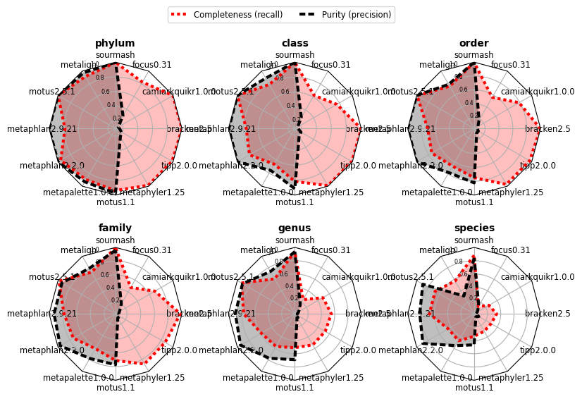

# Compositional analysis with Scaled MinHash and gather

\chaptermark{Gather}

## Introduction

<!--
 - What are the goals of compositional analysis in biological systems?
-->


## Decomposition of queries with gather

\RestyleAlgo{boxruled}
\LinesNumbered
\begin{algorithm}[ht]
   \DontPrintSemicolon
   \SetKwInOut{Input}{Input}
   \SetKwInOut{Output}{Output}
   \SetKwBlock{Loop}{Loop}{}
   \SetKwFunction{FindBestContained}{FindBestContained}
   \SetKwFunction{Subtract}{Subtract}
   \SetKwFunction{AppendToMatches}{AppendToMatches}
   \Input{query $Q$}
   \Input{a collection $C$ of reference datasets}
   \Input{a containment threshold $T$}
   \Output{a list of matches $M$ from $C$ contained in $Q$}
   \BlankLine
   $M \leftarrow \emptyset$\;
   $Q' \leftarrow Q$\;
   \Loop {
       $best = \FindBestContained(Q', C, T)$\;
       \If{$best = \emptyset$ }{
           break\;
       }
       $\AppendToMatches(M, best)$\;
       $Q' \leftarrow \Subtract(M, Q')$\;
   }
   \KwRet{matches}
   \caption{The gather method}
\end{algorithm}

\begin{algorithm}[ht]
  \DontPrintSemicolon
  \SetKwInOut{Input}{Input}
  \SetKwInOut{Output}{Output}
  \SetKwFunction{containment}{containment}
  \SetKwBlock{Loop}{Loop}{}
  \Input{query $Q$}
  \Input{a list $C$ of reference datasets}
  \Input{a containment threshold $T$}
  \Output{the match $m$ for $m \in C$ with best containment in $Q$, or $\emptyset$ if no match above threshold}
  \BlankLine
  $best\_containment \leftarrow T$\;
  $m \leftarrow \emptyset$\;
  \For{$c \in C$}{
     $containment \leftarrow \containment(c,Q)$\;
     \If{$containment \ge best\_containment$ }{
       $best\_containment \leftarrow containment$\;
       $m \leftarrow c$\;
     }
  }
  \KwRet{$m$}
  \caption{a \emph{FindBestContained} implementation for a list}
\end{algorithm}

### CAMI challenges

Critical Assessment of Metagenome Intepretation (CAMI) is a community-driven initiative,
and brings together tool developers to create standard and reproducible
benchmarking methods.
Challenges are organized around common studies in metagenomics,
like marine,
high-strain and rhizosphere datasets.
Sequencing data is generated by using a microbial community and metagenome simulator CAMISIM [@fritz_camisim_2019]
coupled with a gold standard with a known community composition
to model different aspects
(diversity levels, abundances and sequencing technologies features among them)
of datasets.

Each challenge typically includes three tasks:
assembly,
taxonomic profiling and binning (at taxon or genome levels).


Since there is a standard output format that tools need to implement,
performance comparisons can be streamlined.
The CAMI initiative also provides a set of tools for computing performance metrics for each group:
MetaQUAST for assembly,
AMBER for binning,
and OPAL for profiling evaluation.
<!-- TODO
Intro: what is CAMI, what it provides:

- challenges provide gold standards (what is expected to be in the sample)

- standardized tools for profiling performance comparisons (OPAL)
-->

#### CAMI 1 (low, medium, high)

<!-- TODO
- Already published, but results are for older/outdated tools

- still a good benchmark (because gold standards are available)

- low and medium datasets have viruses, which are not in sourmash indices
-->

```{r gatherCAMIlowTable, eval=TRUE, echo=FALSE, message=FALSE, error=FALSE, warning=FALSE, cache=TRUE, out.width="500px", fig.width=4, fig.cap="CAMI I Low table"}
knitr::include_graphics('figure/cami_i_low_table.png')
```

```{r gatherCAMIlowSpider, eval=TRUE, echo=FALSE, message=FALSE, error=FALSE, warning=FALSE, cache=TRUE, out.width="500px", fig.width=4, fig.cap="CAMI I Low spider plot"}
knitr::include_graphics('figure/cami_i_low_recall_precision.png')
```

#### CAMI 2 mouse gut toy challenge

<!-- TODO
- new CAMI challenges, with short and long reads (pacbio)

- toy challenge is calibration: gold standard available

- CAMI provides results for other tools

CAMI 2 refseq database also doesn't have viruses...
-->

```{r gatherCAMImgTable, eval=TRUE, echo=FALSE, message=FALSE, error=FALSE, warning=FALSE, cache=TRUE, out.width="500px", fig.width=4, fig.cap="CAMI II Mouse Gut table"}
knitr::include_graphics('figure/cami_ii_mg_table.png')
```

```{r gatherCAMImgSpider, eval=TRUE, echo=FALSE, message=FALSE, error=FALSE, warning=FALSE, cache=TRUE, out.width="500px", fig.width=4, fig.cap="CAMI II Mouse Gut spider plot"}

```

### Limitations

<!--
- Viruses (scaled minhash too small).
  mash screen solves this by going for sensitivity (at the cost of precision),
  possible solution: scaled+num hashes, but would only allow mash screen-like method

- gather assigns hashes to best matches ("winner-takes-all"). Other approaches
  will be needed to disambiguate matches further
-->

## Implementation

### smol

`smol` is a minimal implementation for the Scaled MinHash sketch and the gather method for simulation and verifying results with more featureful tools.
There are two compatible versions,
one in Python and another in Rust,
due to performance requirements when processing large datasets (like metagenomes).
Both versions of the Scaled MinHash implementations use each language standard library sets
(`set` for Python, `HashSet` for Rust)
for storing hashes and efficient set operations (intersection and difference).
Experiments used the Rust version for calculating Scaled MinHash sketches,
and the Python version for running gather and reporting containment scores.
Since they serialize the sketches to a compatible JSON format,
they can be used interchangeably and while computing Scaled MinHash sketches is
orders of magnitude faster in Rust,
for gather running time are similar and in the order of seconds.

The Python version has two external dependencies:
`screed` for sequence parsing,
and `mmh3` for the MurmurHash3 hash function.
Other modules from the standard library are used for JSON serialization (`json`)
and command line parsing (`argparse`).

The Rust version has four direct external dependencies:
`needletail` for sequence parsing and normalization
(similar to what `screed` does in the Python version),
`murmurhash3` for the MurmurHash3 hash function,
`serde_json` for JSON serialization and `structopt` for command line parsing.

## Evaluation

<!-- TODO
cmash and mash screen can do `gather` too,
but still require the original data available.
Scaled MinHash allows using the sketches for gather,
which are a fraction of the original data in size.
Additional benefit:
if there are collection updates you don't need to recalculate the query sketch,
and both cmash and mash screen would need the original data for the query
again
-->

### Implementation for experiments

Experiments are implemented in `snakemake` workflows and use `conda` for
managing dependencies,
allowing reproducibility of the results with one command:
`snakemake --use-conda`.
This will download all data,
install dependencies and generate the data used for analysis.

The analysis is contained in a Jupyter Notebook,
and can be executed in any place where it is supported,
including in a local installation or using Binder,
a service that deploy a live Jupyter environment in cloud instances.
Instructions are available at https://github.com/luizirber/phd
<!-- TODO: replace with zenodo archival DOI -->

## Conclusion and Future Work


