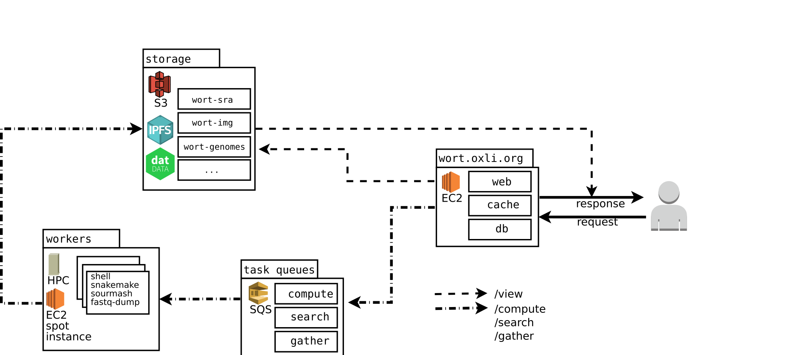
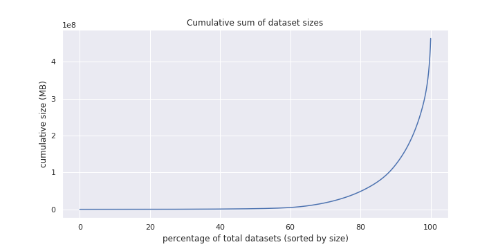

# Distributed signature calculation with wort

\chaptermark {wort}

## Introduction

Signature calculation in sourmash is a low memory and streaming process,
since a signature retains a much smaller subset of the original data
and once a chunk of the data is processed it is not necessary to keep it or refer to it again.
The calculation process is frequently I/O bound on reading data,
unless very fast access to the data is available,
when it becomes CPU-bound by the hashing algorithm.
sourmash signatures are also typically small,
with input sizes in the order of hundreds of times larger than the final signature.
This creates opportunities for approaches where distributed workers do all the expensive data access,
and report back a small amount of computed data.
Systems like \emph{Folding@home} [@beberg_folding_2009] focus on small amounts of input data and heavy computational requirements instead,
but have similar architectures where a central server distributes tasks to workers and collect results.

On top of fast access to one dataset,
indexing large public genomic databases also requires considering another axis:
since there are millions of datasets in these databases,
embarrassingly parallel approaches to access the data are necessary too,
because even with the fastest possible connection it would still take too long to process them all serially.
Given that processing a dataset into a signature can be done independently of other datasets,
a system that can spawn a large number of jobs can potentially keep up with the rate of new dataset inclusion,
and also make it feasible to calculate signatures for the current datasets.

In this sense,
getting access to the data and downloading it is the main bottleneck,
especially considering that high-speed network connections are expensive.
At the same time,
given the embarrassingly parallel nature of signature calculation,
multiple workers can be spawned in different computational infrastructure
(academic clusters, public cloud instances, and even browsers)
with potentially independent network connections.
Then the limitation is how fast data can be served from the public genomic database being indexed;
this is inherently a limitation of centralized data storage.
Cloud solutions disguise these limitations by creating a single access point and rerouting requests to multiple servers,
but accessing it outside the cloud provider infrastructure incurs additional costs.

This chapter explores these distributed architectures and methods for
crowdsourcing signature calculation for large public genomic databases.

## Methods

### Data sources and selection

#### Sequence Read Archive

The Sequence Read Archive [@leinonen_sequence_2011] stores raw sequence data for sequencing experiments,
and is part of the International Nucleotide Sequence Database Collaboration (INSDC)
with the European Nucleotide Archive (ENA) [@leinonen_european_2011] and the DNA Database of Japan (DDBJ) [@kaminuma_ddbj_2010].
Submission to any of them are shared with the others,
although with different methods for accessing and potentially distinct data formats.

Given the large amount of data available and the biological diversity of the datasets,
the initial prototype focused on single genome microbial datasets (excluding metagenomes).
The datasets were selected with a query to the Sequence Read Archive to retrieve enough metadata for processing (dataset ID, size and download location),
but this metadadata is not stored in the signatures.
This avoids synchronization problems when the metadata is updated in the original source,
guiding users to check the original source for more information.

#### IMG

The Integrated Microbial Genomes and Microbiomes (IMG/M) [@chen_imgm_2019] contains assembled genomes
and metagenomes for sequencing done at the Department of Energy's Joint Genome Institute,
focusing on environmental samples.
Because the sequencing data is already assembled,
it is closer to GenBank and RefSeq than the Sequence Read Archive,
which hosts raw sequence data.

Through a "Facilities Integrating Collaborations for User Science" (FICUS) grant we also had access to the JGI IMG/M database,
as well as to the NERSC supercomputers for computational resources.
There were 65 thousand single genome datasets corresponding to the taxons represented in the database,
and metadata was provided independently of online access to IMG.
It represented a snapshot of the data available on the database in October 2017.
The sequencing data was available in a shared storage unit,
and processing was done through NERSC's Cori scheduling system.

### The worker

Based on the initially retrieved metadata,
each dataset was processed by a worker.
Each worker runs an instance of `sourmash`,
with additional software for accessing the data or uploading it to more permanent storage,
depending on what database is being calculated.

For IMG the data was available in a shared filesystem,
so `sourmash compute` could access it directly.

For the SRA the worker uses `fastq-dump` (from the `sra toolkit`) to download the data and stream it through a UNIX pipe into a `sourmash compute` process.
Since the data is being streamed,
it is not being stored locally by the worker,
so if a signature need to be recalculated the data needs to be downloaded again.
Signatures would only need to be recalculated if the `sourmash compute` parameters are changed,
and the initial parameters tried to accommodate for it and cover more use cases,
which leads to a larger signature (but still a fraction of the size of the original data).

### Coordination

The first prototype (named `soursigs`, available at https://github.com/dib-lab/soursigs/)
used the `snakemake` workflow management system [@koster_snakemakescalable_2012] to:

- query metadata from SRA and choose datasets;

- for each dataset, spawn a worker job to process it and generate a signature;

- upload the signature to permanent storage.

This system was able to process 412k datasets and 28 TB of data over two weeks,
<!-- link to soursigs posts?
https://blog.luizirber.org/2016/12/28/soursigs-arch-1/
http://ivory.idyll.org/blog/2017-sourmash-sra-microbial-wgs.html
 -->
but processing was still limited to one system executing all the workers jobs.
Even with the system being a cluster and providing access to many compute nodes,
the external network connection was still shared between all nodes.

This initial prototype only read a small part of the streaming dataset,
since the original scientific goal was to identify novel datasets after comparing them to a reference database.
<!-- TODO  intro syrah, connect to scaled
Due to the random nature of shotgun sequencing
-->
This was also necessary because at this point the Scaled MinHash introduced in chapter 1 was not available yet,
and experiments with `soursigs` led to many of the insights that led to the Scaled MinHash development.

### Storage

Signatures were initially stored locally in the system where they were processed
(NERSC Cori for IMG, MSU HPCC for SRA).
None serve as permanent or public storage,
since they are restricted systems and access can be revoked once projects are concluded.

For convenience,
data was uploaded to Amazon S3,
which makes it easier to share the data but also has drawbacks:

- Storage and data access incur additional costs,
  especially if the data becomes a popular resource and is used frequently.

- Even with all the infrastructure and level of service that AWS provides,
  it is a single point of failure and is not easy to mirror in other places without generating new URLs
  or using some sort of load balancer.

Other data repositories like Zenodo are better for archival purposes,
but not as appropriate for a system that is frequently updated.

## From soursigs to wort

<!-- how and why did soursigs evolve into wort? -->
<!-- mirror structure from previous section, showing how things changed? -->

`wort` was created to fix some of the issues with the initial `soursigs` prototype
and allow more computational systems to participate in the process,
building an heterogeneous system that doesn't depend on similar resources being available for each worker.
The two major changes were:

- encapsulate workers in a Docker container [@boettiger_introduction_2015],
  which is also executable by Singularity [@kurtzer_singularity_2017].
  Docker containers are useful for cloud instances,
  but are usually not available in academic clusters.
  Similarly, Singularity tends to be present in academic clusters,
  but is not as convenient in cloud infrastructures.
  While containers make deployment easier and facilitate distribution,
  all the software dependencies are also available via bioconda [@gruning_bioconda_2018] and conda-forge.

- Use a messaging queue for job submission that can be accessed by workers in any computational system.

Another goal for `wort` is creating a basic API for common tasks that allow external interactions without needing knowledge about the internal implementation.
Since the internal details are not exposed it allows refactoring and reimplementing the infrastructure with other technologies not used in the original version.
In this sense,
the original version is implemented in a more traditional (and centralized) approach,
with a web application written in Flask serving the API and sending job requests to an Amazon Web Services SQS queue.
Workers connect to the queue and grab jobs for execution,
and upload results to Amazon S3.

```{r wortArch, eval=TRUE, echo=FALSE, message=FALSE, error=FALSE, warning=FALSE, cache=TRUE, out.width="500px", fig.width=4, fig.cap="wort architecture"}

```

<!-- TODO: drop the "a little centralization goes a long way" paper here? -->
The coordination of the system is still centralized,
but this new infrastructure allows workers to be executed in any system that has Docker or Singularity support,
including most academic clusters and cloud providers,
as well as local workstations and personal laptops.
Since signature calculation is I/O bound,
CPU resources consumption is proportional to how fast the network connection can provide data,
and the CPU is idle waiting for data most of the time.

Since signature calculation jobs are independent of each other,
the single point of failure of this approach is the centralized coordination.
At the same time,
developing a system is easier if there is no coordination required between most parts of the system,
and given the exploratory nature of this experimental system having an initial implementation that can be used to clarify use cases and figure out the requirements and interfaces needed is very valuable.

Over time the implementation can become less dependant on the original platform used (AWS),
and move to more decentralized approaches.
<!-- It's easier to test and refactor than coming up with the perfect design upfront -->
Because the original version is already working,
refactoring the internal implementation while keeping all tests working allow improvements to the system without breaking the public API and clients using `wort`.

## Results

### Microbial single-genome datasets

As of early June 2020,
there are 1.2 million datasets in the SRA that fit the initial goal of
calculating signatures for microbial genomes.
These datasets represent around 14% of the 8.3 million public datasets in the SRA,
<!--
Total public datasets:
https://www.ncbi.nlm.nih.gov/sra/?term=cluster_public%5Bprop%5D
-->
although this proportion is not representative of the total data size:
this microbial subset contains 352.5 TB of data,
around 2.2% of the 16 PB of publicly-accessible data.

Around 16 thousand datasets weren't processed correctly,
due to missing data in the SRA or because they are too large for the time
allocated for workers and didn't finish downloading in time.
Excluding these 16,000 datasets,
the signatures represent 332 TB of the original data,
stored in 2.4 TB of signature files.

It is worth noting that signatures were calculated with a $\mathbf{scaled}=1000$,
but $332/2.4=138$,
more than expected if considering only final file size.
Although each signature is using this scaled value,
there are 3 Scaled MinHash sketches for each dataset (for $k={21,31,51}$),
and each sketch is also tracking abundance for each hash,
which doubles the storage requirements.

### Datasets from metagenomic sources

`wort` focuses on providing an API for triggering further processing,
and additional logic for updating the signature collection was implemented as
scripts accessing this API.
These scripts only need access to the public API,
and can also to be running in any machine that has access to the `wort` HTTP API.
As an example,
an external script that downloads metadata for datasets recently added to the
SRA is executed everyday for the last two years for the microbial subset.

As long as no special processing is necessary for the datasets,
other subsets of the SRA can be processed by creating similar scripts to submit SRA IDs for computation.
One such subset are metagenomes,
and a query for datasets from metagenomic sources (excluding amplicon, usually associated with 16S)
in the SRA returns 569,475 datasets as of Aug 2020,
with average size of 812 MB and maximum of 170 GB.
Because most datasets are small and the machines running `wort` workers are very
efficient for small datasets,
processing the first 150 TB of data with the current infrastructure took 3 days,
and after that longer datasets are typically processed at a rate of 2 TB/day.

```{r wortMetagSizes, eval=TRUE, echo=FALSE, message=FALSE, error=FALSE, warning=FALSE, cache=TRUE, out.width="500px", fig.width=4, fig.cap="Metagenome dataset sizes"}

```

### Proof of concept: Searching for Metagenome-Assembled Genomes in the SRA

448 thousand datasets from the metagenomic subset were processed from 237 TB of original sequencing data,
totalling 2.1 TB of signatures.
Building a sourmash index (either revindex or SBT) with this amount of data is
prohibitive at the moment,
since both indices load all the data in memory before writing the indices to storage.
This is an implementation detail,
and can be addressed in future versions of sourmash.

In the same vein,
executing sourmash operations over that many signatures is not an use case that was previously considered,
so even operations over a list of signatures (and which don't strictly require indices)
like `sourmash search` end up requiring too much memory when using hundreds of
thousands of metagenome signatures.

Nonetheless,
since sourmash is implemented as a Rust core and a Python API/CLI it is possible to leverage the core
features to prototype a large scale search method in Rust that can efficiently
keep queries in memory and process batches of the metagenome signatures without
needing to store them in memory first,
loading on demand and releasing resources after they are queried.
This approach also benefits from queries being effectively immutable,
and so can be easily shared without data races by multiple processing threads.
This sort of embarrassingly parallel work is a good fit for rayon,
a Rust crate that implements a work-stealing scheduler for tasks and can
parallelize tasks over many threads/CPU cores.

An interesting class of queries for this approach are metagenome-assembled genomes (MAG).
These are genomes derived from metagenomes by assembly of longer contigs from reads,
followed by contig binning and evaluation of completeness and contamination of the bins.
These MAGs sizes are usually in the range of hundreds of thousands to millions of basepairs,
large enough for overcoming the Scaled MinHash sketches limitations when using a scaled of 1000.

Large scaled MAG reconstruction in metagenomes is also a method to expand the number of known organisms,
especially those that lack cultured representatives,
like environmental microbial organisms.
For example,
[@tully_reconstruction_2018] recovered 2,631 draft MAGs from 234 metagenomic samples collected during the Tara Oceans expedition [@pesant_open_2015],
with many from under-characterized taxonomic groups.
These MAGs can be used as queries and searched against a collection of
metagenomes to find additional sequencing data
(for co-assembly and refinement)
and improve the characterization of these organisms,
including geographical distribution and pangenomics analysis.

Executing the search took 11 hours to run,
using less than 5GB of RAM and 24 threads.
The machine used was a workstation with a AMD Ryzen 9 3900X 12-Core CPU running at 3.80 GHz,
64 GB DDR4 2133 MHz of RAM and loading data from an external HDD enclosure connected via USB.
If there is access to additional machines (in a cluster, for example)
it is also possible to parallelize the search even further by splitting the metagenomes into groups,
and running each group in a distinct machine.

The search found 1,407 of the original 2,631 MAGs above 50% containment, in 2,938 metagenomes
(after removing the Tara Oceans datasets from the results, since the MAGs were derived from them).
The 50% threshold was chosen to account for sequencing errors and biological variability,
since Scaled MinHash sketches use exact k-mer matching when calculating containment.

These results can be used to check specific MAGs for further analysis:
for example,
the MAG identified as TOBG_NP-110 (Tara Ocean Binned Genome, North Pacific)
was described in [@tully_reconstruction_2018] as an Archaeal organism from phylum Euryarchaeota,
with a 70.3% completeness score and genome size of 1.24 Mbp,
assembled in 39 contigs with a mean contig length of 31,750 bp.
12 matches above 50% containment were found,
with 5 of them coming from one specific SRA study,
SRP044185.
Samples for this study were collected from a column of water in a station in Manzanillo, Mexico.
Another 3 matches come from study SRP003331,
collected in the South Pacific ocean (in northern Chile).
A third match,
ERR3256923, also comes from the South Pacific.

For validation of the SRA search results,
the original data for each SRA run was downloaded and the metagenome reads mapped back to the MAG using minimap2
[@li_minimap2_2018].
New sourmash signatures for the mapped reads were also calculated and checked
for containment against the original MAG signature.
The containment of the MAG in the reads match the containment estimated with Scaled MinHash sketches,
showing they are good proxies for this kind of search.
The results are in table \@ref(tab:mag-search).

Table: (\#tab:mag-search) Results for MAG TOBG_NP-110 (1,238,250 bp),
showing SRA sequencing runs IDs,
containment of the MAG query,
containment of the MAG in the recovered reads,
missed basepairs and percentage of missed basepairs,
average coverage of the reads in MAG and total reads mapped from the metagenome to the MAG.

| SRA Run ID   |   Containment search |   Containment reads |   Missed bp |   %bp missed |   Coverage |   Reads mapped |
|:-------------|---------------------:|--------------------:|------------:|-------------:|-----------:|---------------:|
| SRR5868539   |                 0.99 |                0.99 |       1,475 |        0.001 |      19.85 |        131,640 |
| SRR1509798   |                 0.98 |                0.98 |       7,771 |        0.006 |      18.52 |        101,441 |
| SRR1509792   |                 0.97 |                0.97 |      26,247 |        0.021 |       9.80 |         63,653 |
| SRR5868540   |                 0.91 |                0.91 |      52,686 |        0.043 |       4.27 |         24,983 |
| SRR1509799   |                 0.89 |                0.89 |      71,116 |        0.057 |       3.88 |         20,014 |
| SRR070081    |                 0.85 |                0.85 |     109,714 |        0.089 |       3.00 |          9,755 |
| ERR3256923   |                 0.81 |                0.81 |     117,748 |        0.095 |       4.08 |         32,130 |
| SRR070083    |                 0.79 |                0.79 |     202,037 |        0.163 |       2.04 |          6,115 |
| SRR1509793   |                 0.79 |                0.79 |     143,021 |        0.116 |       3.47 |         22,495 |
| SRR304680    |                 0.64 |                0.64 |     359,648 |        0.290 |       1.35 |          4,181 |
| SRR070084    |                 0.58 |                0.58 |     450,167 |        0.364 |       1.16 |          3,403 |
| SRR1509794   |                 0.56 |                0.56 |     427,213 |        0.345 |       1.60 |          9,827 |

These results are available as a public git repo in https://github.com/luizirber/2020-07-22-mag-search/
and include links to an interactive notebook that can be executed with Binder for easy exploration.

## Discussion

Making large collections of sequencing data searchable is an open problem,
and approaches that work for smaller collections rarely scale well,
even for current database sizes.
New methods that take advantage of specific particularities of the query and
desired answer can help bridge the gap between more general methods by allowing filtering large databases,
resulting in more manageable subsets that can be used efficiently with current methods.

Scaled MinHash sketches allow calculating similarity and containment between
datasets without the need to access the original datasets.
Because only a fraction
(controlled with the scaled parameter)
of the original data need to be stored,
they are good basic components in the implementation of systems that allow searching large collections of datasets.

wort is a system that takes advantage of how Scaled MinHash sketches are
computed to implement a distributed system where workers are independent of each
other and can process data in an embarrassingly parallel manner.
By using a centralized job queue that is accessible by workers running in
heterogeneous systems (cloud, personal laptops, academic clusters) it allows
horizontal scaling and participation by anyone that can share computational
resources to accelerate data downloads from the original sequencing database.

While planned as an exploration on how to organize such systems,
wort has also successfully calculated over 3 million signatures from three
major public databases: NCBI SRA, JGI IMG and NCBI assemblies (GenBank and
RefSeq).
Over 500 TB of sequencing data were processed,
generating more than 5 TB of sourmash signatures and bringing new use cases and
challenges for sourmash development,
both operational as well as scientific.

wort also provided the foundation for further questions about how to maintain
such system working with limited resources,
and in a way that is resilient to operational changes,
transferable to other infrastructures,
as well as allowing deploying it independently.
These are not simple problems,
and underlie most scientific tools exposed as web services,
especially in bioinformatics.
<!-- TODO: is there a paper that checks how many of these services go away over
time? -->
Cloud infrastructure,
be it commercial like Amazon Web Services or academic/public like Jetstream,
is one possible way to scale these systems,
but the costs for maintaining a system running over time are often overlooked,
and also out of reach for most scientific funding.
Exploring solutions that allow resilience (to avoid the disappearance of the data from the network)
while at the same time allowing faster performance when more resources (computational or financial)
are available can lead to systems that are accessible for deployment and
development for research groups without access to large grants.

The MAG search prototype also serve to guide development of more robust commands to sourmash later.
Being able to test solutions and explore the design space before committing to
long term maintenance requires components that can be used either from a
top-down perspective
(scientific workflows coordinating different programs)
or from a bottom-up approach
(libraries that expose data types and functions that can be composed to create new programs).
sourmash fits both approaches,
using the command-line interface or the Python API for the top-down case,
or the Python API and the Rust core
(depending on the performance requirements)
for the bottom-up case. 
The MAG search can also be seen as a "reverse gather" operation:
while gather focuses on decomposing a query metagenome into reference genomes from a collection,
the MAG search uses a query genome (or large enough genomic dataset) to find metagenomes in a collection that contain the query.
This operation allow use cases where a researcher wants to find a genome of interest in public databases,
such as finding outbreaks of pathological organisms or,
as in the Tara MAGs,
mining for additional samples for an under-characterized organism.

## Conclusion


