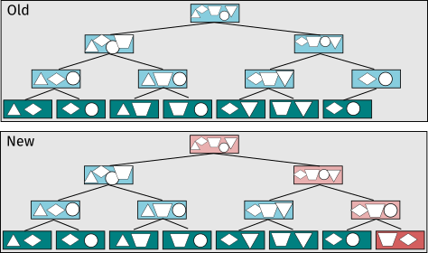

# Decentralizing indices for public genomic data

\chaptermark {Decentralizing}

```{=latex}
\begin{epigraphs}
  \qitem{A complex system that works is invariably found to have evolved from a simple system that worked.
         A complex system designed from scratch never works and cannot be patched up to make it work.
         You have to start over with a working simple system.}%
        {John Gall}
  \qitem{Another flaw in the human character is that everybody wants to build and nobody wants to do maintenance.}%
        {Kurt Vonnegut}
\end{epigraphs}
```

## Introduction

Public genomic databases like GenBank [@benson_genbank_2017] and RefSeq [@oleary_reference_2016] are maintained by NCBI,
responsible for curation and quality control of submissions.
They serve as reference for derived databases too,
with RefSeq being an example:
it is derived from GenBank,
but with stricter quality controls and without a submission process,
since it processes data submitted and accepted in GenBank first.
On top of being responsible for quality control,
NCBI also serves as the archival and canonical data source,
which leads to a common pattern in bioinformatics services:
maintenance and data availability are tied to constant funding of the infrastructure,
and in the cases where funding lapses the resource might become unavailable.
[@gb_editorial_team_closure_2011] presents a scenario describing the hypothetical closure of Sequence Read Archive [@leinonen_sequence_2011],
and a discussion including maintainers,
data producers and end users.
Among the issues raised are budgetary constraints
(for both storage and costs associated with staff for maintaining the databases and processing submissions),
scalability of storing all the raw data being generated,
and long term access to data already archived.

Chapter [4](#distributed-signature-calculation-with-wort)) introduced wort,
a distributed system for signature computation,
and the challenges to efficiently retrieve data from public genomic databases.
This chapter discusses alternatives for increasing resilience for storing and distributing data using decentralizing approaches,
using indices and signatures for datasets in public genomic databases as a concrete problem.
This is achieved by extending sourmash and wort to implement these approaches,
as well as discussing limitations and direction for further improvement.

### Decentralization and recentralization

One of the proposed solutions for scaling the Sequence Read Archive and make it more convenient for users is moving to cloud computing resources,
as an alternative to a central repository with its own public funded infrastructure,
and let companies implement the storage and distribution of the data.
In 2019 the Sequence Read Archive adopted this approach
(on top of maintaining their own existing infrastructure)
with both Amazon Web Service (AWS) and Google Cloud Platform (GCP) serving as storage.
This relieves the pressure on their current infrastructure,
as well as expands bandwidth and throughput for accessing the data,
since both AWS and GCP already have extensive infrastructure in place for their cloud offerings.
Companies also benefit from these arrangements because data is more readily available for their existing users,
and it also attracts new users because there are financial incentives to avoid transferring data out of their cloud infrastructure.
For example,
internal data transfer from SRA to specific regions inside AWS and GCP are not charged,
but transferring data to other systems incur costs,
and given the amount of data available it can get very expensive if you don't become a user and use the AWS or GCP resources for computation too.
This comes at an estimated \$150,000 dollars in monthly costs paid by the NIH to each provider for 10 petabytes of data,
with forecasts to reach 33 petabytes by 2023
[@council_of_councils_working_group_on_sequence_read_archive_data_interim_2020].

Arguably this is an example of decentralization (at the storage level),
since now there are more providers for the same data.
At the same time,
there is recentralization happening due to increased dependency on companies that already monopolize much of the internet infrastructure,
and also raise issues about competition,
since both companies have genomic data analysis services and possibly have conflicts with new (and smaller) companies that decide to use these databases.
This decentralization and recentralization dynamic is characterized in [@schneider_decentralization_2019]:
for every push for decentralization there is potential for recentralization and
new power concentrations by different actors.
Bitcoin is another example of this dynamic:
one of the initial ideas was reducing the dependency on central banks and governments for currency and financial transactions,
but the large computational requirements for proof-of-work mining concentrated most of the network in a small number of very large mining-farms.
At the same time,
totally decentralized systems are usually less efficient,
especially if consensus is necessary.
This is reflected in the enormous energy impact of proof-of-work in Bitcoin,
equivalent to the yearly energy consumption of whole countries [@digiconomist_bitcoin_2020].

Adding some centralized coordination can improve the overall performance of a system [@tsitsiklis_power_2011]
without creating a bottleneck like in fully-centralized system.
At the same time,
some tasks are better executed by centralized systems,
especially if they are activities deemed necessary but with high cost and not as valued by traditional market rules.
Quality assurance and validation can be automated but still require human effort,
while at the same time users demand high-quality data.
Maintaining and validating these datasets is costly and frequently underfunded.
Government and private foundations have resources to fund such approaches,
but generating metrics to justify funding is challenging if there the results of the work are diffuse in the system.

### Technological solutions for decentralizing systems

#### Content addressable storage

Content addressable storage uses the content of the data to generate an address to a dataset.
This is distinct from location-addressed storage,
where the data is store and a location is recorded for later retrieval of the data.
The same data can be stored in two separate locations,
but since the location defines the identity of the data,
one copy doesn't see the other as a potential replica.

One example of content-addressable storage is git.
Every commit in git has a hash attached to it,
calculated based on the content plus some extra metadata
(author and parent commit, for example),
creating a git object.
<!-- mention other types of git objects? -->
The hash is used to index and access the git objects in the repository history,
and they are usually stored in the `.git/storage` directory.
The commit history is a directed acyclic graph (DAG) of these git objects.
Since the parent commit hash is also included in the calculation this
creates a structure where changing (or tampering) with a commit changes all the
hashes depending on this commit,
in turn making the DAG into a Merkle DAG.
<!-- TODO: cite merkle dag/structures -->

While git uses content-addresses for storing the data,
these git objects are not shareable with other repositories automatically.
Finding and synchronizing repositories is an explicit operation,
so when a new `clone` command is executed the user needs to provide the location of the original repository,
and all the objects will be pulled from this one repository,
even if there are many other copies spread around the network
(or even other copies already exist locally in the machine).

Every git repository is self-contained
(can operate only with a local copy of the data)
and git provides operations to synchronize between repositories,
but there is no networking layer for sharing automatically the data with other repositories:
pushing and pulling changes are operations using a single remote,
and they need to be explicitly configured beforehand.

git was originally created for the Linux kernel development,
where change proposals are usually communicated through mailing lists,
but services that streamlined the process for other development models appeared,
with GitHub being the dominant player.
GitHub is a centralized service for hosting repositories,
and the majority of users don't synchronize changes with each other directly,
opting to push and pull changes from GitHub instead.

#### Distributed Hash Tables (DHT)

DHTs originated from research in peer-to-peer (P2P) systems
[@ratnasamy_scalable_2001] [@stoica_chord_2001] [@zhao_tapestry_2004] [@goos_pastry_2001],
with the goal of allowing queries for which node had a specific piece of data.
It exposes a simple key-value store,
but each node of the network is also responsible for storing a small chunk of the store,
with data available in multiple nodes for additional resiliency.
In order to maintain an operational DHT,
protocols for distributing the data between nodes,
and dealing with network partitions (leading to node disconnection) are required.

In the early 2000s P2P networks started using DHTs in large scale for distributing content,
with BitTorrent as a representative example.
A torrent is a file containing metadata for any content being shared in the network,
and includes information about size, blocks (pieces of the data) and checksums
to verify that the data was transmitted without errors.
Initial implementations of the BitTorrent protocol used servers ("trackers") for storing
which peers had which parts of the torrent content,
but content transfer didn't involve these servers:
they were used only as coordinators.
If a server went offline,
peers couldn't discover any new peers,
and so the network was vulnerable to anything that affected the server.
With DHTs,
instead of storing peer information in a server,
the torrent file was added to the DHT,
and peers could announce (again at the DHT) which blocks of the torrent they have.

#### The Interplanetary File System (IPFS)

One drawback of using the torrent files as the unit of data is that creating
another torrent file with the same content means that the two torrent files can't
see blocks from each other (even if they exactly the same).
Torrents bring the distributed network routing for peer discovery and content addressing at the torrent file level,
but they lack content-addressable storage at the block level.

On the other hand,
git has content-addressable storage,
and one could create a DHT that indexes git objects addresses,
mapping it to what nodes in the network have it available.
Instead of querying a single remote node,
this would allow git to fetch remote objects from many sources,
and any user that cloned the same repository is a potential provider for the data.

The Interplanetary File System (IPFS) [@benet_ipfs_2014]
builds on these two ideas.
IPFS addresses are hashes of the content organized as a Merkle DAG like git,
but using a DHT for peer and content discovery,
like Bittorrent.

## Methods

### The MHBT index is amenable to content addressable approaches

The MHBT index introduced in chapter [2](#minhash-bloom-tree) has structural features that make it a
good fit for content-addressable approaches.
Leaf nodes in an MHBT are signatures for a specific dataset,
and are effectively immutable for public genomic databases,
since any changes to a dataset in these databases generate a new version or identifier.
Signatures can also change if other parameters for calculating their sketches are used,
but having a default set of "good enough" parameters like the ones defined in `wort`
allows general queries that can later be refined once a candidate subset of the database is found.

```{r sbtInsert, eval=TRUE, echo=FALSE, message=FALSE, error=FALSE, warning=FALSE, cache=TRUE, out.width="60%", fig.cap="Inserting a dataset in an MHBT"}

```
Insertion of new signatures to an MHBT trigger changes in the path from new leaf
location to root of the tree,
but all other nodes are left unchanged.
Even if new methods for signature placement in the tree are developed in the future,
in the worst case at most half of the total nodes (the internal nodes) would change,
but the other half (the leaves) would stay the same.

### Flexible and resilient indices with leaf-only MHBTs

Since MHBTs follow a similar principle to Merkle DAGs,
where the content of an internal node depends on the content of the subtree defined by using the internal node as the root,
this also means that given only the leaves of a tree and their placement it is possible to reconstruct all the internal nodes (and so the full MHBT).
This opens the possibility of distributing MHBT indices as leaf-only MHBTs:
a description of the tree structure with the leaves placement,
and where to download the content for each leaf.
This information is enough to reconstruct the full index,
and also prioritizes storage and distribution of a minimal amount of data,
since the internal nodes content is redundant information (for allowing faster queries)
and are potentially mutable (on new signature insertions to the index).

While internal nodes are bad candidates for long-term archival (given their size),
they are still good candidates for short-term caching for performance,
either locally or loaded from the network.
A trade-off is making internal nodes available in the network,
but not failing local operations with the index if they fail to load:
either recalculate the internal node (more expensive)
or proceed with the operation anyway (if possible).
For the latter case,
a search where an internal node is missing can proceed by queueing the children of the node for search,
which is less efficient than a regular search (the search could potentially stop at that node and avoid checking the subtree),
but is a better user experience than failing completely.
In the worst case where only the leaves are available,
this search turns into a linear scan over a list.

## Results

### Hosting an MHBT index on IPFS

MHBTs in \emph{sourmash} use a `Storage` instance to save and load data,
with the default storage being a hidden directory with all the content for internal nodes and leaves and,
in the future (version 4),
Zip files.
\emph{sourmash} support for IPFS is implement as an instance of the `Storage` interface that communicates with an IPFS node running at the same machine or on a remote location.
Since it follows the same interface,
any operations on other storages is also supported with the IPFS backend.

Saving data is implementing by sending an `add` request to the IPFS node and pinning the data.
A pin is an operation that instructs an IPFS node to avoid garbage-collecting the data,
making a good fit for long-term availability.
Once the data is saved,
a new IPFS multihash is returned,
which serves as a location for addressing this data in the network from now on.
Loading data involves passing an IPFS multihash to the storage,
and returns a byte buffer ready for consumption.

### sourmash operations using a decentralized index

In order to evaluate sourmash operations using the IPFS backend,
six experiments were performed exploring different aspects:
a full MHBT index versus a leaf-only MHBT index,
with machines reflecting different levels of performance and network access.
sourmash version 3.3.0 was used for the experiments,
and all experiments are running a `sourmash gather` command on an MHBT index with 5914 signatures.
These signatures are a subset of the prepared GenBank database that sourmash provides,
while the query signature is an iHMP metagenome [@integrative_hmp_ihmp_research_network_consortium_integrative_2014].

The three machines used for the experiments reflect different levels of performance:

- `takver` is a workstation with fast CPU (AMD Ryzen 9 3900X 12-Core running at 3.80 GHz),
  memory (64 GB DDR4 2133 MHz)
  and storage (2 TB NVMe Samsung SSD 970 EVO Plus),
  connected to a Gigabit local network with access to the UC Davis network.

- `datasilo` is a compute stick,
  a system with limited computational resources aimed at the low cost market.
  It has an Intel Atom x5-Z8330 CPU running at 1.44 GHz,
  2 GB DDR3 1600 MHz of memory,
  a 32 GB internal eMMC storage,
  and it is connected to the same Gigabit local network as `takver`.

- `rosewater` is a 2015 laptop with resources typically found on a regular user notebook:
  an Intel Core i7-5600U CPU running at 2.60GHz,
  16GB DDR3 1600MHz of memory,
  and 1 TB mSATA Samsung 860 SSD for storage.
  It is not on the same network as the other machines,
  and it connects to the internet with a 20 Mbps DSL connection.

<!--
- issues with current results:
  takver, datasilo and rosewater are wildly different machines, too many confounding factors?
  At the same time, it's good to have an underpowered machine like datasilo,
  and a regular laptop like rosewater because they show clearly what are the CPU/mem or network trade-offs.
-->

#### MHBT index with an IPFS storage

Experiment 1) uses a Zipped MHBT index,
with a storage using a Zip file for holding the tree structure and all the nodes compressed data.
This will be the default format in \emph{sourmash} 4,
and is more convenient than the previous hidden directory storage.
The goal of this experiment is to define a baseline to compare both each individual machine performance and the decentralizing approaches described in previous sections.

Experiments 2) and 3) use the same MHBT index as 1), but with an IPFS backend as storage.
2) and 3) are the same experiment,
with the only difference being that 3) is executed right after 2),
and so all the data is already available in the local IPFS node and no network transfer is needed.
The goal is to show the performance impact of a cold start (experiment 2),
and what is the overhead that IPFS imposes when used in conditions more similar to experiment 1),
when all the data is available.

Table: (\#tab:sbt-ipfs) Performance of MHBT operations with IPFS storage.
Units in seconds, with fold-difference to the baseline in parenthesis.

| Experiment     | takver | datasilo   | rosewater   |
|:---------------|-------:|-----------:|------------:|
| 1) Local (ZIP) | 9      | 43 (4.7x)  | 14 (1.5x)   |
| 2) IPFS        | 12     | 115 (9.5x) | 415 (34.5x) |
| 3) IPFS rerun  | 12     | 64 (5.5x)  | 23 (1.9x)   |

<!--
sourmash index -k 51 --traverse-directory index.sbt.zip sigs/
sourmash index -k 51 --traverse-directory index.sbt.json sigs/
sourmash storage convert -b ipfs index.sbt.json

time to download zipped DB: 1m53s
-->

Experiment 1) is a measure of raw processing power,
and as expected `takver` is the fastest one.
`datasilo` suffers from the low cost components in the system,
taking 4.7 times longer to run.

Experiment 2) shows the impact of loading the data from the network.
For `takver` the impact is smaller,
since it is also the data seeder for the other machines,
and ends up showing the performance overhead of using IPFS
(since `sourmash` communicates with an external IPFS process to load/save the data).
The IPFS storage is 33% slower than the Zip storage (9 to 12 seconds).
For `datasilo`,
which is in the same Gigabit network as `takver`,
using IPFS is 2.6 times slower (43 to 115 seconds).
Data loading in `sourmash` storages is sequential,
so even with a very fast network the throughput is low.
This effect is even clearer with `rosewater`,
which has a slower connection with higher latency and is almost 30 times slower (14 to 415 seconds) than loading from a Zip file.

Experiment 3) show the impact of IPFS overhead if the data is already available in the local IPFS node.
For `takver` it is the same as experiment 2),
but for the other machines the results are closer to what happened with `takver`,
with `datasilo` being 48% slower and `rosewater` being 64% slower than the Zip storage.
Despite `rosewater` having the worst relative performance
(64% versus 33% and 48% for the other machines),
it is important to point out that all results are in the order of seconds,
and since `datasilo` has lower performance hardware it takes longer in absolute numbers,
being over a minute for this experiment.
<!-- TODO: A better experiment would be taking `rosewater` to the lab,
     and connect to the same network. Alas, we are in the middle of a pandemic,
     and I want to avoid going there if possible =] -->

#### Leaf-only MHBTs

The goal of leaf-only MHBTs is to increase resilience and reduce storage space,
trading it for performance costs.
Experiments 4), 5) and 6) changes the MHBT index to a leaf-only MHBT,
but otherwise they follow the same conditions as experiments 1-3.

Table: (\#tab:leaf-ipfs) Performance of a leaf-only MHBT operations with IPFS storage. Units in seconds, with fold-difference to the baseline in parenthesis.

| Experiment              | takver | datasilo    | rosewater    |
|:------------------------|-------:|------------:|-------------:|
| 4) Leaf-only (zip)      | 20     | 92 (4.6x)   | 35 (1.7x)    |
| 5) Leaf-only IPFS       | 31     | 307 (14.6x) | 1267 (40.8x) |
| 6) Leaf-only IPFS rerun | 31     | 170 (5.4x)  | 63 (2x)      |

<!--
sourmash index -k 51 --sparseness 1 --traverse-directory index_leaf.sbt.zip sigs/
sourmash index -k 51 --sparseness 1 --traverse-directory index_leaf.sbt.json sigs/
sourmash storage convert -b ipfs index_leaf.sbt.json

time to download zipped DB: 51s
-->

The relative performance difference shows a 2-3 times slowdown when comparing experiments 4-6 to their counterparts in the previous section.
We can see more clearly the performance impact of reconstructing the internal nodes in experiment 4),
where all systems take twice as long to run when compared to experiment 1).

Experiment 5) show a drawback of the leaf-only approach,
combined with the sequential nature of sourmash storages:
since all the leaves are required for reconstruction,
it will potentially have to download more data than a query to an MHBT fully loaded into an IPFS storage,
since it can't prune subtrees from the search space (and so avoid downloading them).
`rosewater` is particularly impacted,
with a runtime of more than 20 minutes.

## Discussion

If there is a system for sharing the node contents,
this means that once users download an MHBT index they can become new seeders for future users.
In the worst case,
where only the initial seeder is available,
it becomes a centralized system and the whole network depends on the resources and bandwidth that the seeder provides.
This is typically the situation for most bioinformatics web services.

IPFS was chosen because it provides implementations in multiple programming languages,
and has a large user and developer base that can drive development of useful features in the long term.
IPFS is a good candidate for the features required to do this,
but any system with similar features can also be used.


### Future work

<!-- initial TODO
 - Updating and syncing separate indices. Mergeable replicated data types

 - Integrating into wort. wort as minimal shim over decentralized infra.
-->

In the current version only the content of each node (internal or leaf) is stored in a decentralized manner,
but index construction and updating is not synchronized.
There is no protocol for merging changes if multiple users start from the same index but update it with their own data.
This is an active area of research,
but recent developments involving Conflict-Free Replicated Data Types (CRDTs) [@shapiro_conflict-free_2011],
and especially Mergeable Replicated Data Types (MRDTs) [@kaki_mergeable_2019] point in promising directions,
with the latter defining semantics for merging tree-like structures that are applicable to MHBTs.

While these methods can provide the technical means for fully decentralized indices,
they don't solve organizational problems that also arise,
or even if the system design should aim for a global index that is updated with every single new signature that
is added to an initial index.
For public databases there is a ground truth that provides what signatures should be present in an index,
but private collections of signatures could be organized as a group of users
sharing a single index and updating each other local copies when any user add
new signatures.

`wort` initially focused in calculating signatures for public genomic databases,
but since it already has the immutable parts of MHBTs (the signatures) available
on IPFS it is a good candidate for being extended and also provide leaf-only
MHBT indices for these databases.

<!-- TODO this might be better in chapter 4? -->
While the `wort` service is currently implemented as a central server that coordinates new submissions and requests for computing new signatures,
the main benefit it brings is a clear API that doesn't have to change if the implementation start using other technologies.
As an example,
the first prototype uploaded the data only to AWS S3,
and the IPFS upload was added later.
Moreover,
there is also a command-line interface (CLI) that currently communicates directly with the central API for downloading data,
but following the same principle of the public interface of the CLI not changing
if the implementation changes it can serve as a minimal shim over more decentralized approaches.
